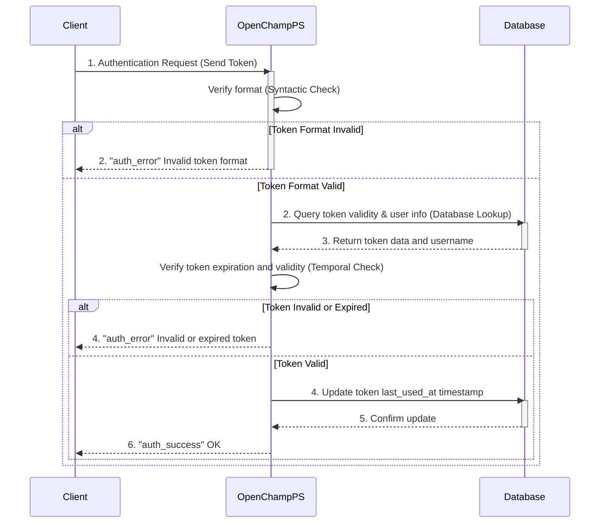

---
tags:
  - Authentication-Endpoints
---

This endpoint authenticates a user with a token via WebSocket connection to an OpenChampPS instance.

### Request

`WebSocket Endpoint: /ws`

**Message Type:** `token_auth`

---

### Input Schema


#### Message Structure

| Field     | Type   | Description                              | Required |
| :-------- | :----- | :--------------------------------------- | :------- |
| `type`    | String | Must be `token_auth` for token requests. | Yes      |
| `payload` | Object | Contains the authentication token.       | Yes      |

#### Payload Fields

| Field   | Type   | Description                                | Required | Constraints                |
| :------ | :----- | :----------------------------------------- | :------- | :------------------------- |
| `token` | String | The user's authentication token (UUID).    | Yes      | Valid UUID format          |

---

### Output Schema

#### Response Message (`auth_success`)

| Field     | Type   | Description                                    |
| :-------- | :----- | :--------------------------------------------- |
| `type`    | String | Will be `auth_success` for successful login.   |
| `payload` | Object | Contains authentication details.               |

#### Payload Fields

| Field      | Type   | Description                                    |
| :--------- | :----- | :--------------------------------------------- |
| `username` | String | The authenticated user's username.             |
| `token`    | String | Authentication token for subsequent requests.  |

---

### Error Responses

#### Error Codes


| Message Type   | Error Code/Message              | Description                                     |
| :------------- | :------------------------------ | :---------------------------------------------- |
| `auth_error`   | `Invalid token format`          | The token message payload is malformed.         |
| `auth_error`   | `Invalid or expired token`      | The provided token is invalid or has expired.   |

---

### Sequence Diagram

### Example

This example demonstrates authenticating a user with an authentication token.

!!! example "User Login via Token"

    **WebSocket Connection**
    ```javascript
    const ws = new WebSocket('ws://<your-server-address>/ws');
    ```

    **Request Message**
    ```json
    {
      "type": "token_auth",
      "payload": {
        "token": "550e8400-e29b-41d4-a716-446655440000"
      }
    }
    ```

    **Response Message (auth_success)**
    ```json
    {
      "type": "auth_success",
      "payload": {
        "username": "jane.doe",
        "token": "550e8400-e29b-41d4-a716-446655440000"
      }
    }
    ```

    **Error Response (auth_error)**
    ```json
    {
      "type": "auth_error",
      "payload": {
        "message": "Invalid or expired token"
      }
    }
    ```


