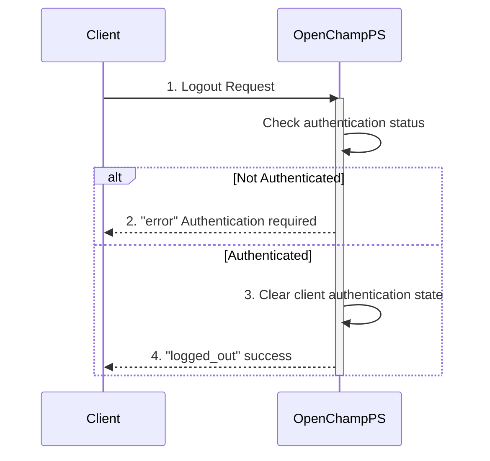

---
tags:
  - Authentication-Endpoints
---

This endpoint logs out an authenticated user by clearing authentication state via WebSocket connection to an OpenChampPS instance. **The token remains valid in the database after logout.**

### Request

`WebSocket Endpoint: /ws`

**Message Type:** `logout`

---

### Input Schema


#### Message Structure

| Field     | Type   | Description                              | Required |
| :-------- | :----- | :--------------------------------------- | :------- |
| `type`    | String | Must be `logout` for logout requests.    | Yes      |
| `payload` | Any    | Payload is ignored (can be empty/null).  | No       |

---

### Output Schema

#### Response Message (`logged_out`)

| Field     | Type   | Description                                    |
| :-------- | :----- | :--------------------------------------------- |
| `type`    | String | Will be `logged_out` for successful logout.    |

---

### Error Responses

#### Error Codes

| Message Type   | Error Code/Message              | Description                                     |
| :------------- | :------------------------------ | :---------------------------------------------- |
| `error`        | `Authentication required`       | User is not authenticated (no active session).  |

---

### Sequence Diagram



---

### Example

This example demonstrates logging out a user by clearing their client-side authentication state.

!!! example "User Logout via WebSocket"

    **WebSocket Connection**
    ```javascript
    const ws = new WebSocket('ws://<your-server-address>/ws');
    ```

    **Request Message**
    ```json
    {
      "type": "logout"
    }
    ```

    **Response Message (logged_out)**
    ```json
    {
      "type": "logged_out"
    }
    ```

    **Error Response (not authenticated)**
    ```json
    {
      "type": "error",
      "payload": {
        "message": "Authentication required",
        "code": "AUTH_REQUIRED"
      }
    }
    ```


