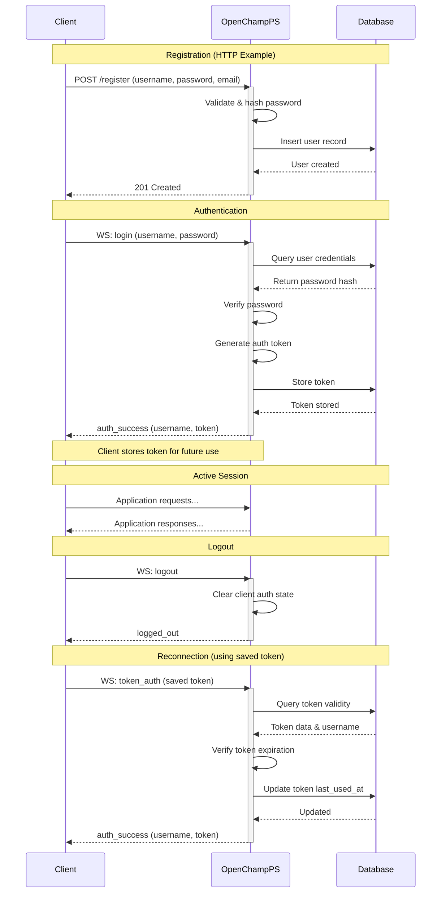

---
tags:
  - Authentication-Endpoints
  - Overview
---

This section describes the authentication system for OpenChampPS holisticly. Reading the releated technical detailing is recomended. 

## Authentication Architecture

OpenChampPS's' authentication system uses **HTTP and WebSocket** endpoints:

### Transport Protocols

| Protocol      | Use Case                                        | Registration | Login | Token Auth | Logout |
| :---------    | :------------------------------------------     | :----------- | :---- | :--------- | :----- |
| **HTTP**      | Initial registration only                       | ✓            | ✗     | ✗          | ✗      |
| **WebSocket** | Authentication + session management             | ✓            | ✓     | ✓          | ✓      |

### Authentication Methods

OpenChampPS currently supports three authentication methods all using WebSocket:

| Method                        | Use Case                                   | 
| :---------                    | :------------------------------------------|
| **Username/Password Login**   | For accessing a token on a new session     |
| **Token-Based Authentication**| For maintaining or reviving a session      |
| **Registration login**        | One time for fluid access to auth          |

---

## Endpoint Quick Reference

#### **User Registration**

| Endpoint         | Auto-Login |
| :-------         | :--------- |
| `POST /register` | No         |
| `WS: register`   | Yes        |

#### **User Authentication**

| Endpoint         | Input                        | Recommended usage |
| :-------         | :----                        | :------- |
| `WS: login`      | username + password          | Initial authentication |
| `WS: token_auth` | token (UUID)                 | Session restoration|
| `WS: register`   | username + password + email* | Registration|

**Email is toggleable via env varible (see guide)* 

#### **User Logout**

| Endpoint | Effect |
| :------- | :----- |
| `WS: logout` | Clears client authentication state|

---

## Authentication Sequence

