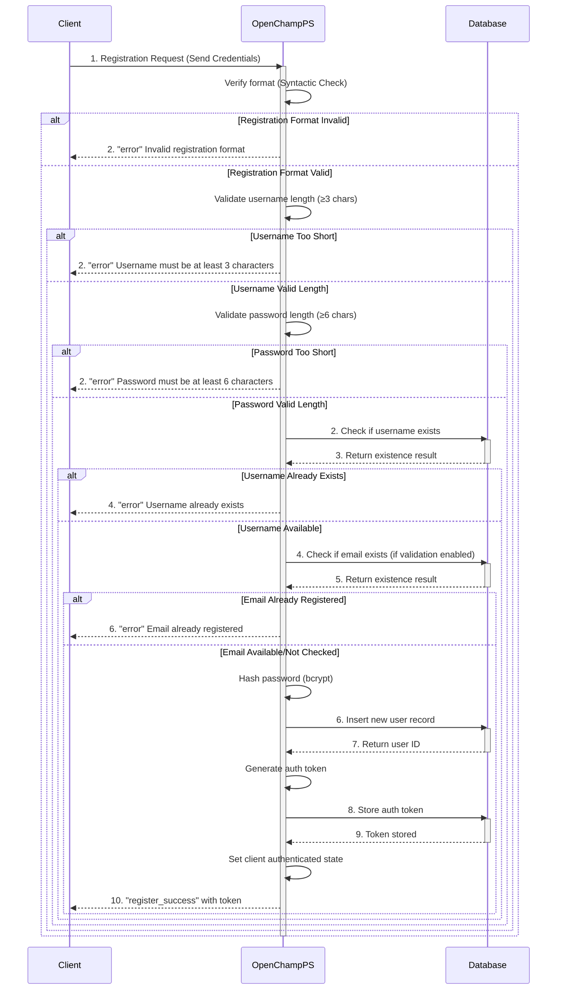

---
tags:
  - Authentication-Endpoints
---

This endpoint registers a new user account with username, password, and optional email via WebSocket connection to an OpenChampPS instance. **Upon successful registration, the user is automatically authenticated and receives an auth token.**

### Request

`WebSocket Endpoint: /ws`

**Message Type:** `register`

---

### Input Schema


#### Message Structure

| Field     | Type   | Description                              | Required |
| :-------- | :----- | :--------------------------------------- | :------- |
| `type`    | String | Must be `register` for registration.     | Yes      |
| `payload` | Object | Contains the registration credentials.   | Yes      |

#### Payload Fields

| Field      | Type   | Description                                | Required | Constraints            |
| :--------- | :----- | :----------------------------------------- | :------- | :--------------------- |
| `username` | String | The desired unique username.               | Yes      | Minimum 3 characters   |
| `password` | String | The user's password.                       | Yes      | Minimum 6 characters   |
| `email`    | String | The user's email address.                  | No       | Must be unique if provided and email validation is enabled |

---

### Output Schema

#### Response Message (`register_success`)

| Field     | Type   | Description                                    |
| :-------- | :----- | :--------------------------------------------- |
| `type`    | String | Will be `register_success` for successful registration. |
| `payload` | Object | Contains registration and authentication details. |

#### Payload Fields

| Field       | Type    | Description                                    |
| :---------- | :------ | :--------------------------------------------- |
| `success`   | Boolean | Will be `true` for successful registration.    |
| `message`   | String  | Will be "Registration successful".             |
| `autoLogin` | Boolean | Indicates if user was auto-authenticated.      |
| `username`  | String  | The registered username (if autoLogin is true). |
| `token`     | String  | Authentication token for subsequent requests (if autoLogin is true). |

---

### Error Responses

#### Error Codes

| Message Type   | Error Code/Message              | Description                                     |
| :------------- | :------------------------------ | :---------------------------------------------- |
| `error`        | `Invalid registration format`   | The registration message payload is malformed.  |
| `error`        | `Username must be at least 3 characters` | Username is too short.           |
| `error`        | `Password must be at least 6 characters` | Password is too short.           |
| `error`        | `Username already exists`       | The username is already taken.                  |
| `error`        | `Email already registered`      | The email is already in use (when email validation is enabled). |
| `error`        | `Registration failed due to a server error` | An internal server error occurred. |

---

### Sequence Diagram


---

### Example

This example demonstrates registering a new user account.

!!! example "User Registration via WebSocket"

    **WebSocket Connection**
    ```javascript
    const wss = new WebSocket('wss://<your-server-address>/ws');
    ```

    **Request Message**
    ```json
    {
      "type": "register",
      "payload": {
        "username": "john.smith",
        "password": "mySecurePass456",
        "email": "john.smith@example.com"
      }
    }
    ```

    **Response Message (register_success with auto-login)**
    ```json
    {
      "type": "register_success",
      "payload": {
        "success": true,
        "message": "Registration successful",
        "autoLogin": true,
        "username": "john.smith",
        "token": "550e8400-e29b-41d4-a716-446655440000..."
      }
    }
    ```

    **Error Response (username already exists)**
    ```json
    {
      "type": "error",
      "payload": {
        "message": "Username already exists",
        "code": "REGISTRATION_ERROR"
      }
    }
    ```

    **Error Response (password too short)**
    ```json
    {
      "type": "error",
      "payload": {
        "message": "Password must be at least 6 characters",
        "code": "REGISTRATION_ERROR"
      }
    }
    ```


