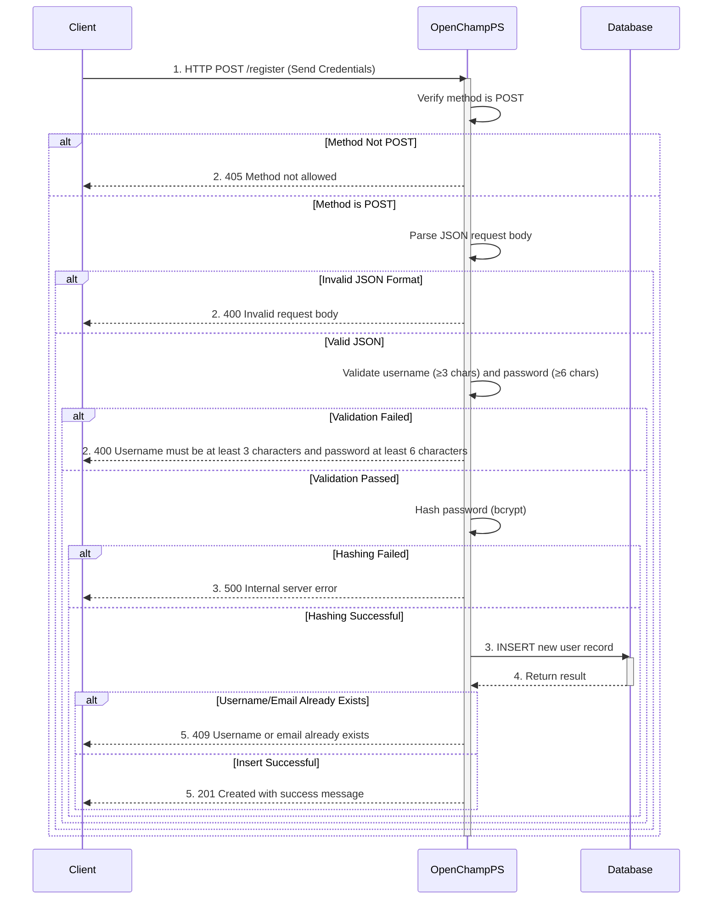

---
tags:
  - Authentication-Endpoints
  - HTTP-API
---

This endpoint registers a new user account with username, password, and optional email via HTTP REST API to an OpenChampPS instance. **Does not provide authentication. Users must login separately after registration.**

### Request

`HTTP Endpoint: POST /register`

**Method:** `POST`

**Content-Type:** `application/json`

---

### Input Schema

#### Request Body

| Field      | Type   | Description                                | Required | Constraints            |
| :--------- | :----- | :----------------------------------------- | :------- | :--------------------- |
| `username` | String | The desired unique username.               | Yes      | Minimum 3 characters   |
| `password` | String | The user's password.                       | Yes      | Minimum 6 characters   |
| `email`    | String | The user's email address.                  | No       | Must be unique if provided |

---

### Output Schema

#### Success Response (HTTP 201 Created)

**Response Body:**

| Field     | Type   | Description                                    |
| :-------- | :----- | :--------------------------------------------- |
| `status`  | String | Will be `success` for successful registration. |
| `message` | String | Will be "User registered successfully".        |

#### Response Headers

| Header         | Value              |
| :------------- | :----------------- |
| `Content-Type` | `application/json` |

---

### Error Responses

#### Error Status Codes

| Status Code | Error Message                                                                       | Description                                     |
| :---------- | :---------------------------------------------------------------------------------- | :---------------------------------------------- |
| `400`       | `Invalid request body`                                                              | The request body is malformed or not valid JSON.|
| `400`       | `Username must be at least 3 characters and password at least 6 characters`         | Username or password validation failed.         |
| `405`       | `Method not allowed`                                                                | HTTP method is not POST.                        |
| `409`       | `Username or email already exists`                                                  | The username or email is already in use.        |
| `500`       | `Internal server error`                                                             | An internal server error occurred.              |

---

### Sequence Diagram


---

### Example

This example demonstrates registering a new user account via HTTP API.

!!! example "User Registration via HTTP"

    **HTTP Request**
    ```http
    POST /register HTTP/1.1
    Host: <your-server-address>
    Content-Type: application/json
    {
      "username": "john.smith",
      "password": "mySecurePass456",
      "email": "john.smith@example.com"
    }
    ```

    **cURL Example**
    ```bash
    curl -X POST http://<your-server-address>/register \
      -H "Content-Type: application/json" \
      -d '{
        "username": "john.smith",
        "password": "mySecurePass456",
        "email": "john.smith@example.com"
      }'
    ```

    **Success Response (201 Created)**
    ```json
    {
      "status": "success",
      "message": "User registered successfully"
    }
    ```

    **Error Response (400 Bad Request - Validation)**
    ```
    Username must be at least 3 characters and password at least 6 characters
    ```

    **Error Response (409 Conflict - Duplicate)**
    ```
    Username or email already exists
    ```

    **Error Response (400 Bad Request - Invalid JSON)**
    ```
    Invalid request body
    ```

---

