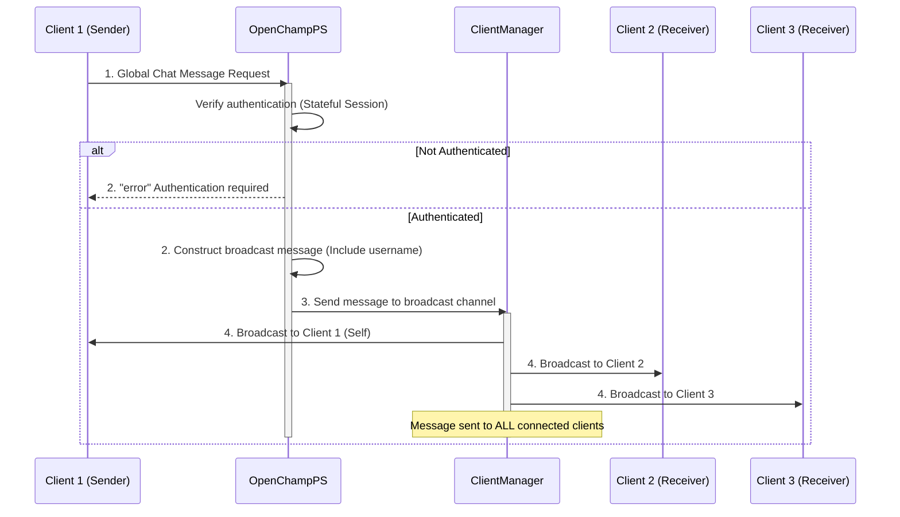

---
tags:
  - Chat-Endpoints
---

This endpoint broadcasts a message to all connected players in the OpenChampPS instance via WebSocket connection.

### Request

`WebSocket Endpoint: /ws`

**Message Type:** `global_chat`

---

### Input Schema


#### Message Structure

| Field     | Type   | Description                                     | Required |
| :-------- | :----- | :---------------------------------------        | :------- |
| `type`    | String | Must be `global_chat` for global chat messages. | Yes      |
| `payload` | String | The message content to broadcast.               | Yes      |

---

### Output Schema

#### Response Message (`global_chat`)

| Field     | Type   | Description                                    |
| :-------- | :----- | :--------------------------------------------- |
| `type`    | String | Will be `global_chat` for broadcast messages.  |
| `payload` | Object | Contains the sender and message details.       |

#### Payload Fields

| Field      | Type   | Description                                    |
| :--------- | :----- | :--------------------------------------------- |
| `username` | String | The username of the message sender.            |
| `message`  | String | The message content that was broadcast.        |

---

### Error Responses

#### Error Codes


| Message Type   | Error Code/Message              | Description                                        |
| :------------- | :------------------------------ | :----------------------------------------------    |
| `error`        | `AUTH_REQUIRED`                 | User must be authenticated before sending global chat messages. |

---

### Sequence Diagram

### Example

This example demonstrates sending a message to all connected players via global chat.

!!! example "Send Global Chat Message via WebSocket"

    **WebSocket Connection**
    ```javascript
    const ws = new WebSocket('ws://<your-server-address>/ws');
    ```

    **Request Message**
    ```json
    {
      "type": "global_chat",
      "payload": "Hello everyone!"
    }
    ```

    **Response Message (global_chat) - Broadcast to All Clients**
    ```json
    {
      "type": "global_chat",
      "payload": {
        "username": "jane.doe",
        "message": "Hello everyone!"
      }
    }
    ```

    **Error Response (Authentication Required)**
    ```json
    {
      "type": "error",
      "payload": {
        "message": "Authentication required",
        "code": "AUTH_REQUIRED"
      }
    }
    ```