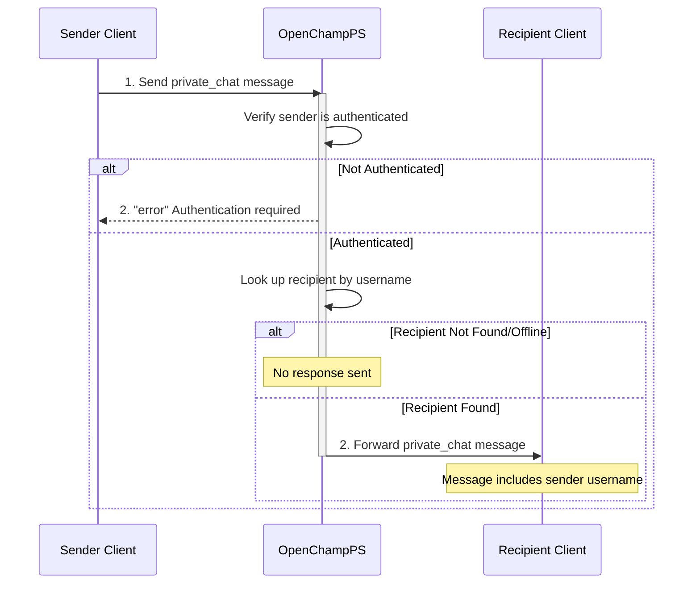

---
tags:
  - Chat-Endpoints
---

This endpoint allows authenticated users to send private messages to other users via WebSocket connection to an OpenChampPS instance.

### Request

`WebSocket Endpoint: /ws`

**Message Type:** `private_chat`

---

### Input Schema


#### Message Structure

| Field     | Type   | Description                                      | Required |
| :-------- | :----- | :----------------------------------------------- | :------- |
| `type`    | String | Must be `private_chat` for private messages.     | Yes      |
| `payload` | Object | Contains the message details and recipient.      | Yes      |

#### Payload Fields

| Field      | Type   | Description                                      | Required | Constraints            |
| :--------- | :----- | :----------------------------------------------- | :------- | :--------------------- |
| `target`   | String | The username of the message recipient.           | Yes      | Must be a valid user   |
| `message`  | String | The private message content to send.             | Yes      | Non-empty string       |

---

### Output Schema

#### Response Message (`private_chat`)

| Field     | Type   | Description                                      |
| :-------- | :----- | :----------------------------------------------- |
| `type`    | String | Will be `private_chat` for received messages.    |
| `payload` | Object | Contains the message details and sender info.    |

#### Payload Fields

| Field      | Type   | Description                                      |
| :--------- | :----- | :----------------------------------------------- |
| `username` | String | The sender's username.                           |
| `message`  | String | The private message content.                     |

---

### Error Responses

#### Error Codes

| Message Type   | Error Code/Message              | Description                                     |
| :------------- | :------------------------------ | :---------------------------------------------- |
| `error`        | `Authentication required`       | User is not authenticated.                      |
| N/A            | No response                     | Recipient is not online or does not exist.      |

---

### Sequence Diagram



### Example

This example demonstrates sending a private message to another user.

!!! example "Private Chat via WebSocket"

    **WebSocket Connection**
    ```javascript
    const ws = new WebSocket('ws://<your-server-address>/ws');
    ```

    **Request Message (Sender)**
    ```json
    {
      "type": "private_chat",
      "payload": {
        "target": "john.doe",
        "message": "Hey, how's it going?"
      }
    }
    ```

    **Response Message (Recipient Receives)**
    ```json
    {
      "type": "private_chat",
      "payload": {
        "username": "jane.doe",
        "message": "Hey, how's it going?"
      }
    }
    ```

    **Error Response (Not Authenticated)**
    ```json
    {
      "type": "error",
      "payload": {
        "message": "Authentication required",
        "code": "AUTH_REQUIRED"
      }
    }
    ```