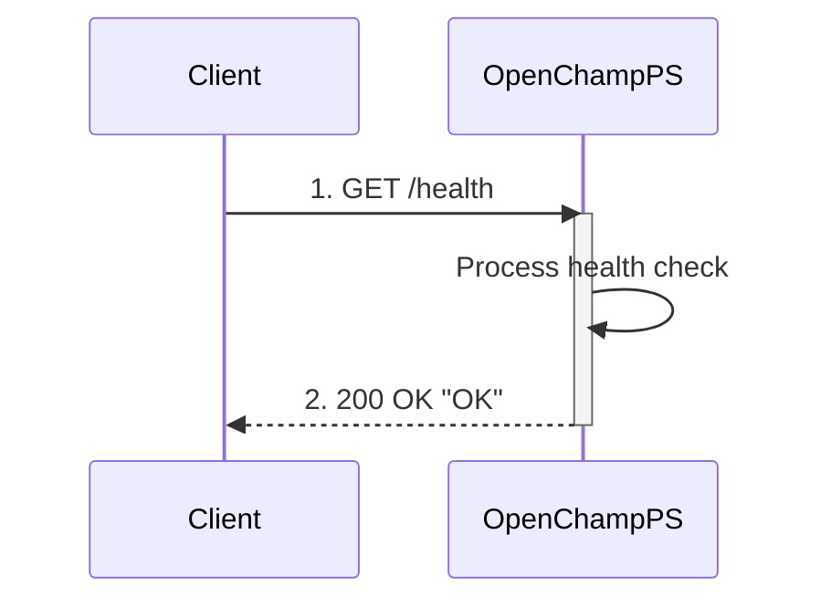

---
tags:
  - Health-Endpoints
---

This endpoint provides a simple health check to verify that the OpenChampPS server is running and responsive.

### Request

`HTTP Endpoint: GET /health`

**Method:** `GET`

---

### Output Schema

#### Response (Success)

| Field         | Type   | Description                                      |
| :------------ | :----- | :----------------------------------------------- |
| `Status Code` | Number | HTTP 200 OK                                      |
| `Body`        | String | Plain text response containing "OK"              |

---

### Error Responses

#### Error Codes

| Status Code | Description                                       |
| :---------- | :------------------------------------------------ |
| N/A         | No application-level errors are returned          |

---

### Sequence Diagram



### Example

This example demonstrates checking the health status of the OpenChampPS server.

!!! example "Health Check via HTTP"

    **HTTP Request**
    ```bash
    curl http://<your-server-address>:8080/health
    ```

    **Response (Success)**
    ```
    OK
    ```

    **Response Headers**
    ```
    HTTP/1.1 200 OK
    Content-Type: text/plain; charset=utf-8
    Content-Length: 2
    ```

    **Using fetch in JavaScript**
    ```javascript
    fetch('http://<your-server-address>:8080/health')
      .then(response => response.text())
      .then(data => console.log(data))  // Logs: "OK"
      .catch(error => console.error('Health check failed:', error));
    ```

