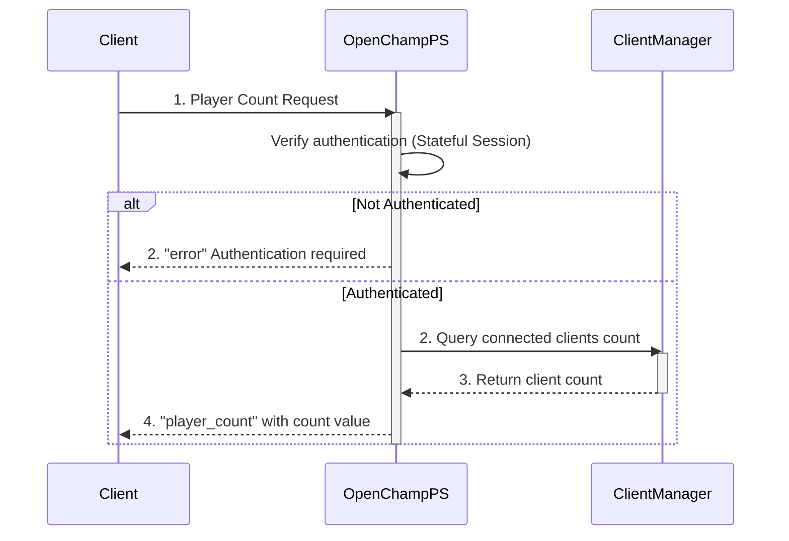

---
tags:
  - Lobby-Endpoints
---

This endpoint retrieves the current number of players connected to the OpenChampPS instance via WebSocket connection.

### Request

`WebSocket Endpoint: /ws`

**Message Type:** `count`

---

### Input Schema


#### Message Structure

| Field     | Type   | Description                              | Required |
| :-------- | :----- | :--------------------------------------- | :------- |
| `type`    | String | Must be `count` for player count requests. | Yes      |
| `payload` | N/A    | No payload required for this request.    | No       |

---

### Output Schema

#### Response Message (`player_count`)

| Field     | Type    | Description                                    |
| :-------- | :------ | :--------------------------------------------- |
| `type`    | String  | Will be `player_count` for successful response. |
| `payload` | Integer | The total number of currently connected players. |

---

### Error Responses

#### Error Codes


| Message Type   | Error Code/Message              | Description                                     |
| :------------- | :------------------------------ | :---------------------------------------------- |
| `error`        | `AUTH_REQUIRED`                 | User must be authenticated before requesting player count. |

---

### Sequence Diagram

### Example

This example demonstrates retrieving the current player count.

!!! example "Get Player Count via WebSocket"

    **WebSocket Connection**
    ```javascript
    const ws = new WebSocket('ws://<your-server-address>/ws');
    ```

    **Request Message**
    ```json
    {
      "type": "count"
    }
    ```

    **Response Message (player_count)**
    ```json
    {
      "type": "player_count",
      "payload": 42
    }
    ```

    **Error Response (Authentication Required)**
    ```json
    {
      "type": "error",
      "payload": {
        "message": "Authentication required",
        "code": "AUTH_REQUIRED"
      }
    }
    ```


