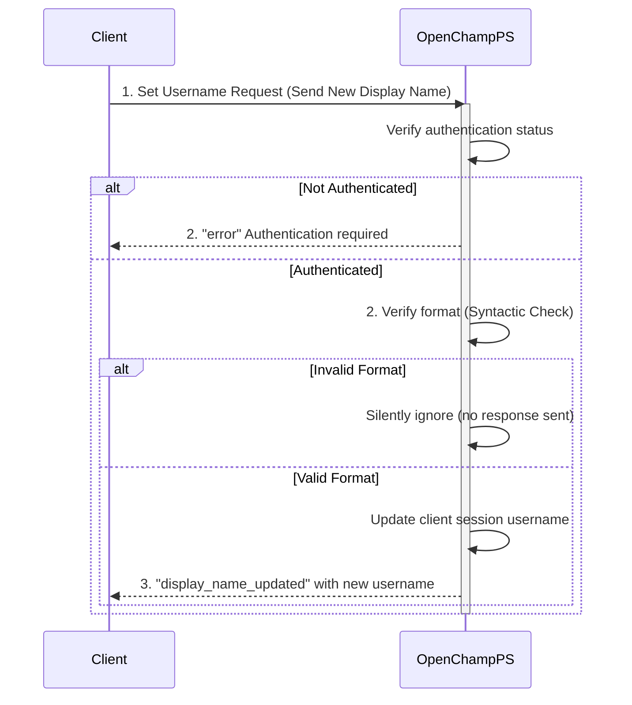

---
tags:
  - User-Endpoints
---

This endpoint allows an authenticated user to update their display username for the current WebSocket session via connection to an OpenChampPS instance.

### Request

`WebSocket Endpoint: /ws`

**Message Type:** `set_username`

---

### Input Schema


#### Message Structure

| Field     | Type   | Description                              | Required |
| :-------- | :----- | :--------------------------------------- | :------- |
| `type`    | String | Must be `set_username` for username update requests. | Yes      |
| `payload` | String | The new display username.                | Yes      |

#### Payload Fields

| Field      | Type   | Description                                | Required | Constraints            |
| :--------- | :----- | :----------------------------------------- | :------- | :--------------------- |
| `payload`  | String | The new display username (direct string value). | Yes      | None enforced          |

---

### Output Schema

#### Response Message (`display_name_updated`)

| Field     | Type   | Description                                    |
| :-------- | :----- | :--------------------------------------------- |
| `type`    | String | Will be `display_name_updated` for successful update. |
| `payload` | String | The updated display username.                  |

---

### Error Responses

#### Error Codes


| Message Type   | Error Code/Message              | Description                                     |
| :------------- | :------------------------------ | :---------------------------------------------- |
| `error`        | `Authentication required`       | User is not authenticated before attempting to set username. |

---

### Sequence Diagram

### Example

This example demonstrates updating a user's display username after authentication.

!!! example "Set Username via WebSocket"

    **WebSocket Connection**
    ```javascript
    const wss = new WebSocket('ws://<your-server-address>/ws');
    ```

    **Request Message**
    ```json
    {
      "type": "set_username",
      "payload": "CoolGamer42"
    }
    ```

    **Response Message (display_name_updated)**
    ```json
    {
      "type": "display_name_updated",
      "payload": "CoolGamer42"
    }
    ```

    **Error Response (error - Not Authenticated)**
    ```json
    {
      "type": "error",
      "payload": {
        "message": "Authentication required",
        "code": "AUTH_REQUIRED"
      }
    }
    ```


